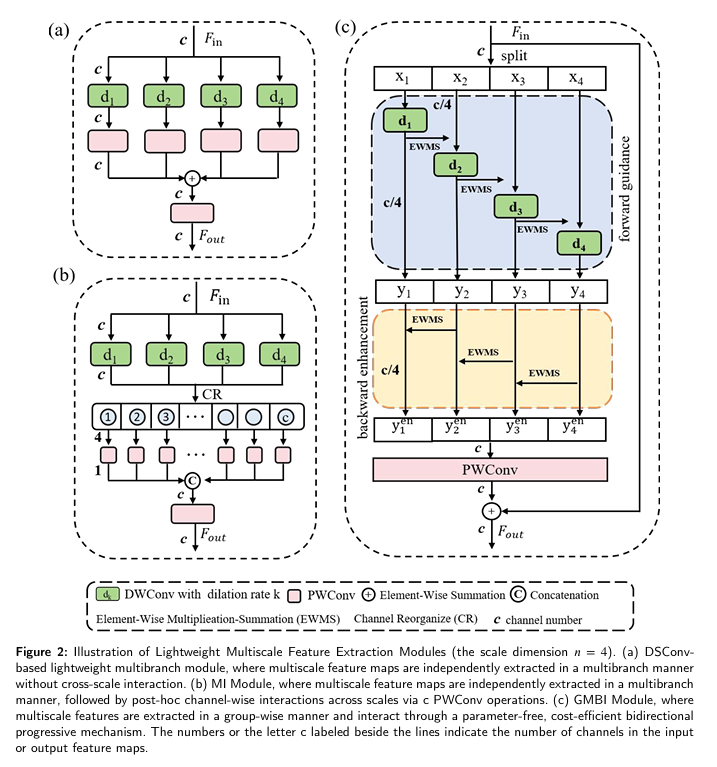

# A Lightweight Group Multiscale Bidirectional Interactive Network for Real-Time Steel Surface Defect Detection
## Methods
In this paper, we propose the Group Multiscale Bidirectional Interactive (GMBI) module, a novel lightweight structure that extends DSConv to support efficient multiscale feature extraction and interaction. Specifically, GMBI partitions the input tensor into channel-wise groups, with each group responsible for extracting features at a distinct scale. This design maintains channel capacity while reducing overall complexity. To facilitate cross-scale feature interaction, we introduce the Bidirectional Progressive Feature Interactor (BPFI), which enables hierarchical feature refinement through forward and backward paths. In the forward path, smaller-scale features guide larger-scale representation learning through hierarchical priors, while in the backward path, larger-scale features refine spatial detail at lower levels via attention cues. Additionally, we design a lightweight, parameter-free fusion operation called Element-Wise Multiplication-Summation (EWMS) that emphasizes salient regions via element-wise multiplication and integrates complementary context through summation, enhancing discriminative representation at negligible computational cost.

We provide prediction downloads via Baidu Netdisk. Please download the checkpoint in the inference stage from the URL below:

**Baidu Netdisk**

url：https://pan.baidu.com/s/1BtAYUKHZWM3FYqf1UBkNpw?pwd=vsid extraction code (提取码)：vsid 
